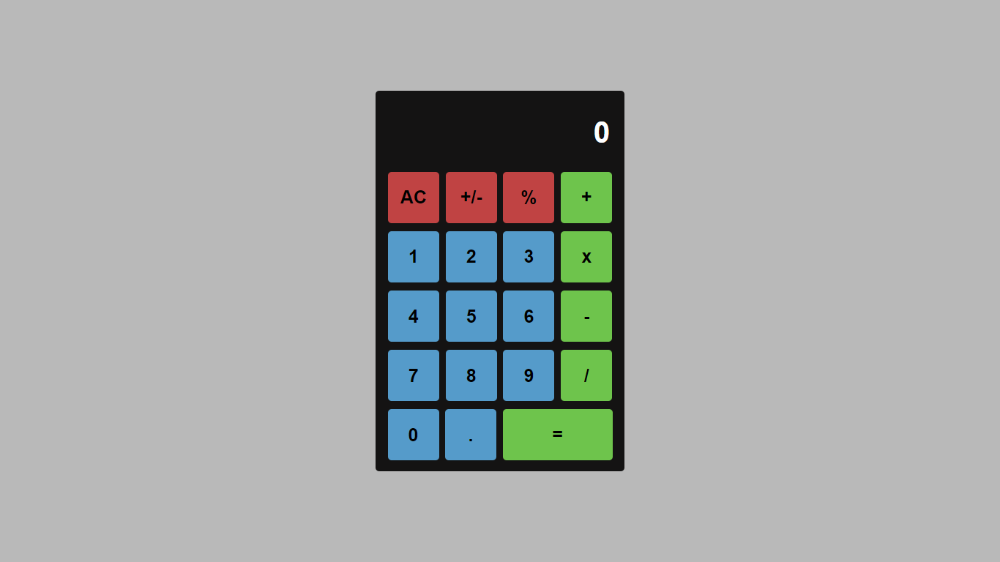

# Calculator

## About

### This is a simple calculator project

## Technologies

-   Framework - React js

## Building

You'll need Node.js installed on your computer in order to build this app.

    git clone https://github.com/ronaldo-max/calculator.git
    $ cd calculator
    $ npm install
    $ npm start

## License

This project is under the MIT license. See the LICENSE file for more details.